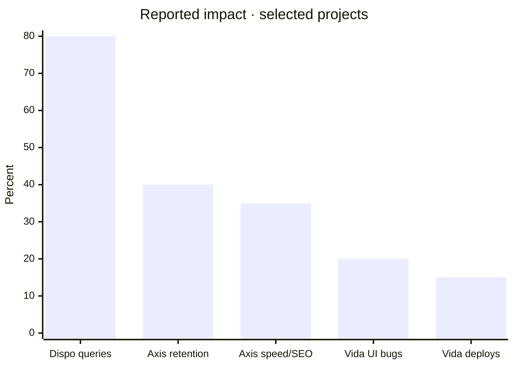

  
  <h1>Software Engineer · Full-Stack Developer · UX/UI Designer</h1>
  
Building real products where product thinking, visual quality and reliable engineering meet.

  

    
    
    
  

## Profile

I’m a Software Engineer and Full-Stack Developer focused on UX/UI and product thinking. I design and ship SaaS platforms, e-commerce systems, dashboards and business automation for real-world operations.

My work goes from functional problem discovery to production: architecture, responsive interfaces, databases, authentication, payments, AI integrations and deployment. I care about products that are clear, fast and genuinely useful.

**Based in:** Resistencia, Chaco, Argentina · **Open to:** Remote / hybrid opportunities

## What I build

<table>
  <tr>
    <td width="50%"><strong>Product systems</strong> SaaS, dashboards, inventory, CRM and payments</td>
    <td width="50%"><strong>Experience systems</strong> UX/UI, responsive interfaces, motion and visual identity</td>
  </tr>
  <tr>
    <td><strong>Automation</strong> AI agents, WhatsApp workflows and operational tooling</td>
    <td><strong>Product storytelling</strong> Landing pages and conversion-focused digital experiences</td>
  </tr>
</table>

## Featured products

| Product | What I solved | Stack |
| --- | --- | --- |
| [Dispo](https://dispo.ar) | Sports-club SaaS with live reservations, tournaments, sales, stock and AI-assisted WhatsApp workflows. | Next.js · React · TypeScript · Supabase · PostgreSQL · OpenAI API |
| [Vexo](https://vexo.ar) | Commercial operating system connecting inventory, sales, CRM, payments, shipping and configurable storefronts. | Next.js · React · TypeScript · NeonDB · Mercado Pago |
| [Portfolio](https://www.iserre.site) | Editorial portfolio with lightweight mode, bilingual navigation and an optional 3D experience. | Next.js · React · TypeScript · GSAP · Spline |
| [JuanchiCar](https://github.com/Brahiamm56/Gestor-de-Inventario-y-Ventas---JuanchiCar) | Inventory and sales management system designed for day-to-day commercial operations. | Java · MySQL · MVC |

## Selected impact

*Percentages are reported outcomes from selected products and work experiences.*

## Stack

  
  
  
  
  
  
  
  
  
  
  
  

## GitHub activity

  
  

  

## Currently building

- 🏗️ SaaS workflows and internal tools for SMEs
- 🤖 AI + WhatsApp automation for commercial teams
- 🚀 Product-led web experiences with strong visual direction

## Let’s connect

[Portfolio](https://www.iserre.site) · [LinkedIn](https://www.linkedin.com/in/brahiam-iserre-7ba07537a/) · [GitHub](https://github.com/Brahiamm56) · [Email](mailto:brahiamiserre10@gmail.com)
